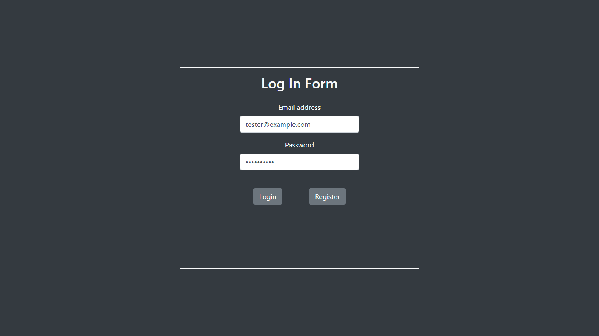
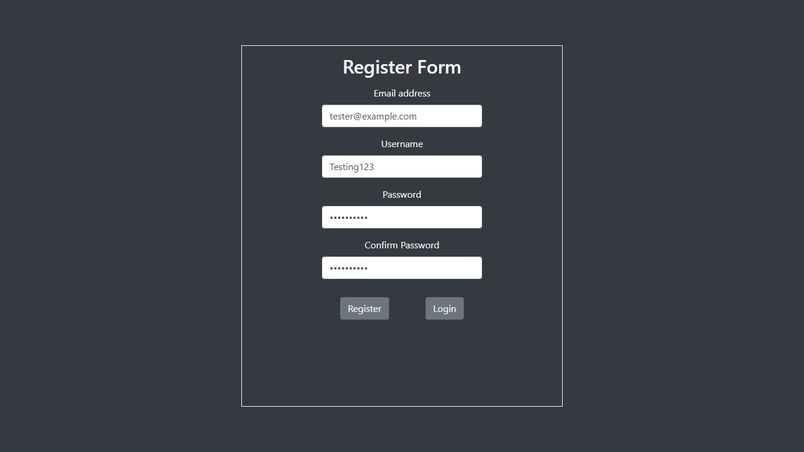
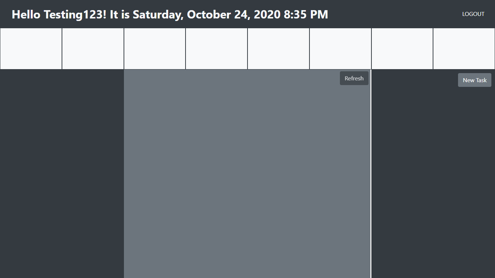
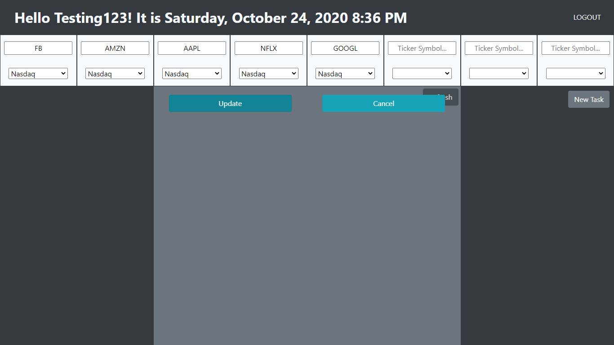
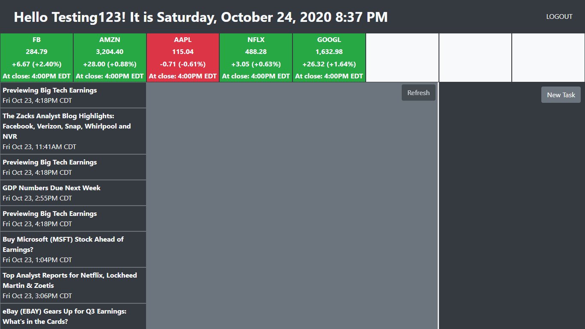
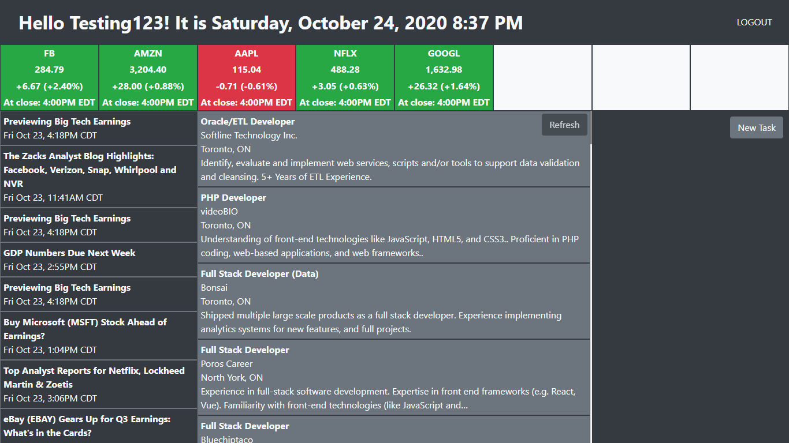
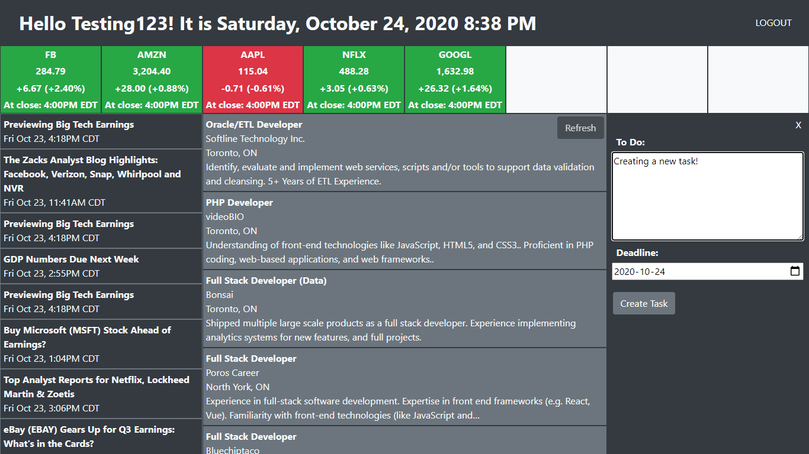
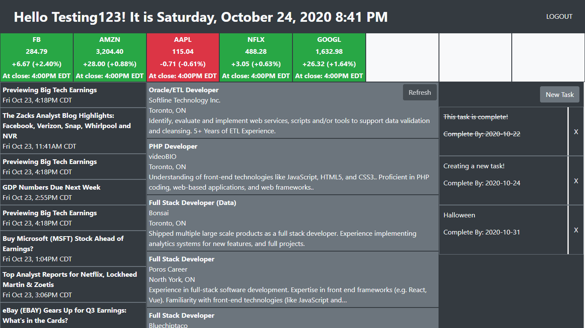

# My Dashboard  

### Summary  

For the sake of trying to be more productive, I created a personalized dashboard web application. It serves as a task manager, a job posting compiler, and tracks financial stock price and news data.  

To view the coding documentation for this web application, refer to the link below:  
[Coding Documentation Link](https://ikim1991.github.io/coding-documentation/#/dashboard/)  

The application is deployed through GitHub Pages and Heroku. The application can be found in the link below:  
[Production Website Link](https://ikim1991.github.io/my-dashboard-app/)  

The source code for the client side can be found in the link below:  
[Client Side Source Code](https://github.com/ikim1991/my-dashboard-app/)  

The back-end application is hosted on Heroku using its free-tier plan. This may cause the first login to take a few seconds to load as the app is put to sleep after 30 minutes of inactivity.  

The web application is currently not supported on mobile/tablet.  

### Images  

  
The main Login Page (Screenshot from 1366x768 resolution)  

  
Register Page (Screenshot from 1366x768 resolution)  

  
Main page on first load after registering (Screenshot from 1366x768 resolution)  

  
Lobby (Screenshot from 1366x768 resolution)  

  
Updating stock tickers and financial data (Screenshot from 1366x768 resolution)  

  
Collection of job postings (Screenshot from 1366x768 resolution)  

  
Create a new task and add to the To-Do list (Screenshot from 1366x768 resolution)  

  
Example of what the dashboard could look like (Screenshot from 1366x768 resolution)  

### License  

The MIT License (MIT)  

Copyright 2020 Chris Kim  

Permission is hereby granted, free of charge, to any person obtaining a copy of this software and associated documentation files (the "Software"), to deal in the Software without restriction, including without limitation the rights to use, copy, modify, merge, publish, distribute, sublicense, and/or sell copies of the Software, and to permit persons to whom the Software is furnished to do so, subject to the following conditions:  

The above copyright notice and this permission notice shall be included in all copies or substantial portions of the Software.  

THE SOFTWARE IS PROVIDED "AS IS", WITHOUT WARRANTY OF ANY KIND, EXPRESS OR IMPLIED, INCLUDING BUT NOT LIMITED TO THE WARRANTIES OF MERCHANTABILITY, ITNESS FOR A PARTICULAR PURPOSE AND NONINFRINGEMENT. IN NO EVENT SHALL THE AUTHORS OR COPYRIGHT HOLDERS BE LIABLE FOR ANY CLAIM, DAMAGES OR OTHER LIABILITY, WHETHER IN AN ACTION OF CONTRACT, TORT OR OTHERWISE, ARISING FROM, OUT OF OR IN CONNECTION WITH THE SOFTWARE OR THE USE OR OTHER DEALINGS IN THE SOFTWARE.  
